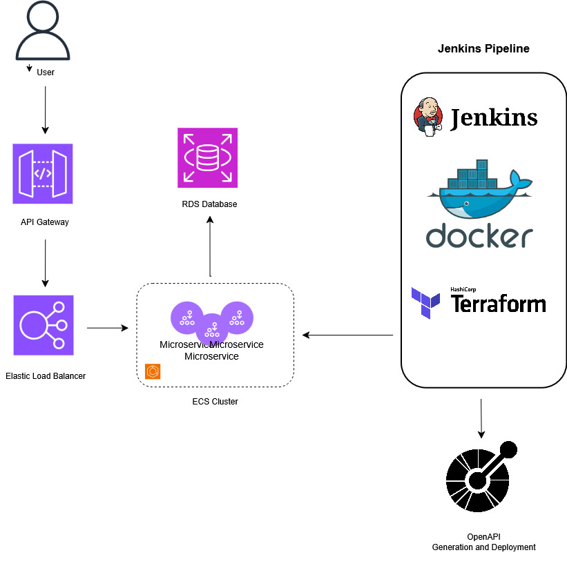

# ☁️ Spring Boot 3 Microservices Boilerplate

> 🚀 A cloud-native boilerplate for rapidly building scalable, modular, secure Spring Boot microservices — designed for real-world production deployment on AWS.

---

### 🧠 Purpose

This repository has been published **for portfolio and demonstration purposes**.  
It contains production-grade patterns and tooling, but it is **not a ready-to-run template out of the box** — some **tweaking and configuration** will be necessary depending on your use case and environment.

---

### 📌 Features

- ✅ **Spring Boot 3.x** with modular microservice structure
- 🔐 JWT-based authentication with Spring Security
- 📚 OpenAPI integration with automatic spec generation and client code
- 🐳 Uses `org.springframework.boot:spring-boot-docker-compose` to spin up development dependencies (like DBs) on the fly using Docker (adjust `compose.yml` as needed)
- 🧬 jOOQ and Spring Data JPA coexistence
- 🐳 Docker multi-arch builds with Buildx
- 🔁 Jenkins CI/CD pipeline (build, test, deploy)
- 📦 Gradle cache restored/stored in **S3**
- 📄 Auto-updated `application.yml` name property per project
- 📦 OpenAPI doc generation baked into the CI/CD flow
- ☁️ **Terraform modules** for provisioning:
    - AWS ECS (Fargate)
    - API Gateway
    - CloudWatch
    - IAM roles
    - CloudFront configuration
- 🧪 Testcontainers for integration tests
- 📈 CloudWatch logging & monitoring integration
- 🧿 **DEPRECATED**: Kubernetes manifest featuring auto scaling and nginx ingress
    - Was used in a Karpenter environment

---

### 🛠 Technologies Used

| Layer | Tech |
|------|------|
| **Language** | Java 17, Kotlin DSL (Gradle) |
| **Framework** | Spring Boot 3.x |
| **CI/CD** | Jenkins, Docker Buildx |
| **Infrastructure** | AWS, Terraform |
| **Testing** | JUnit 5, Testcontainers, RestAssured |
| **Docs** | OpenAPI (SpringDoc) |
| **DB** | MySQL / MariaDB (via RDS or local) |

---

### 📥 How to Use

This project is **not plug-and-play**, but a **starter base**. Here’s how you can use it:

1. **Clone this repository**
2. Adjust `application.yml` and secrets to your environment
3. Configure Jenkins credentials and GitHub/Nexus settings
4. Modify Terraform variables to match your AWS setup
5. Set up your custom business logic in the service module

---

### 🔁 CI/CD Pipeline Overview

The Jenkinsfile includes stages for:

- ✅ Restoring Gradle cache from S3
- 🔬 Running tests and generating OpenAPI specs
- 🐳 Building and pushing Docker images (multi-arch)
- 🛠 Applying Terraform infra changes
- 📤 Deploying services to ECS and updating API Gateway

---

### 📌 Disclaimer

This project has been published as part of **my developer portfolio**.  
It reflects patterns and tooling used in real-world production but is **not intended as a turn-key solution**.

Please feel free to explore, adapt, and build on top of it.

---

### ⭐️ License

This boilerplate is shared under the [MIT License](./LICENSE).

---
